# Hi, I'm Amol 👋

## Flutter Developer

I am a Flutter Developer with 1+ years of experience building production-level mobile applications.

### Skills
- Flutter & Dart
- BLoC State Management
- REST API Integration
- Firebase
- Git
- Android & iOS Deployment

### Featured Project

## Employee Attendance Management App

A production-ready attendance management application built using Flutter.

Features:
- Employee authentication
- Punch In / Punch Out
- Offline attendance support
- API integration
- Data synchronization
- Firebase integration
- Android & iOS deployment

Tech Stack:
Flutter | Dart | BLoC | REST API | Firebase

## 📱 Application Screenshots

### 🔐 Login Module

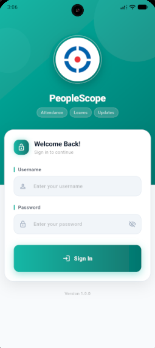

---

### 🏠 Dashboard Module

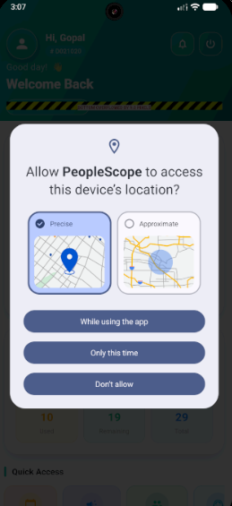

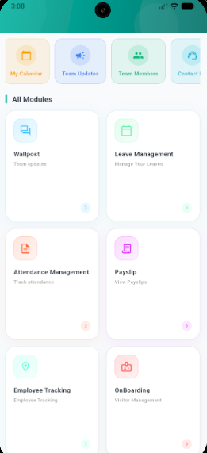

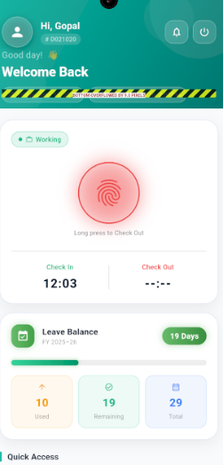

---

### 🕒 Attendance Management Module

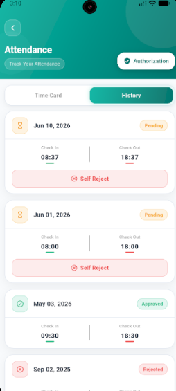

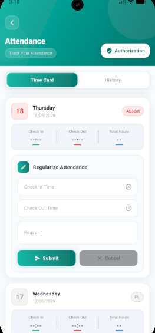

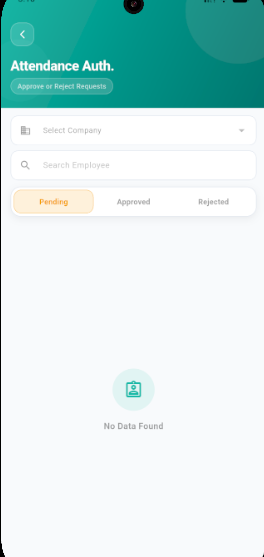

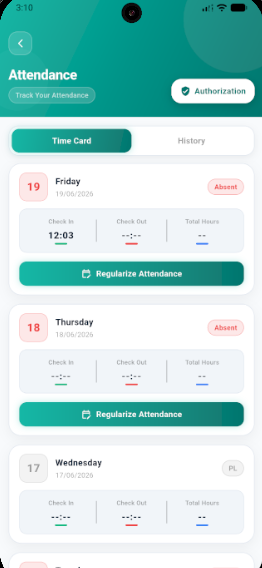

---

### 📝 Leave Management Module

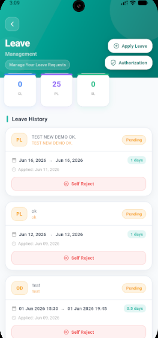

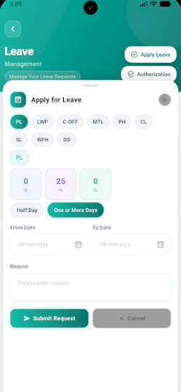

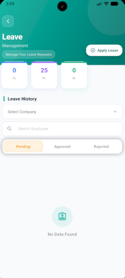

---

### 📢 Wallpost Module

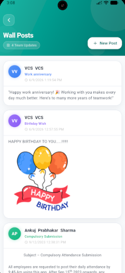

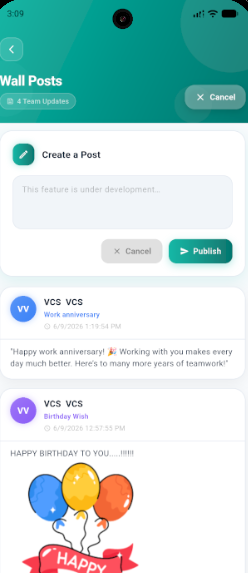
